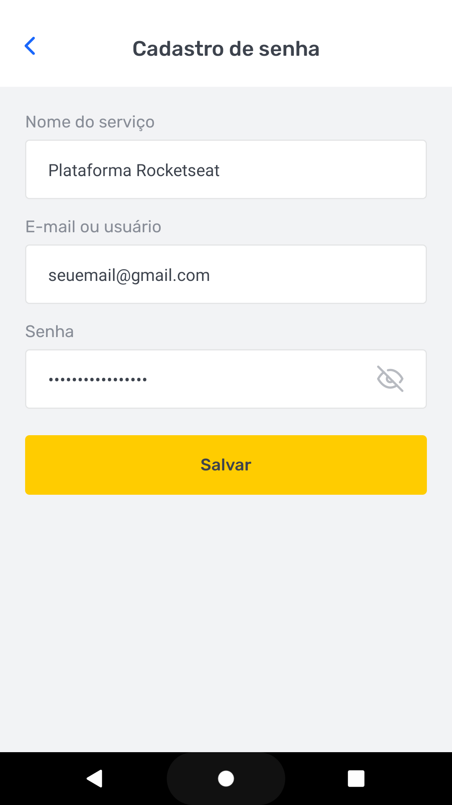

## 💻 Sobre o projeto

🔑 savepass - aplicação mobile para gerenciamento de senhas nos mais diverso serviços usados pelo usuário.

Projeto desenvolvido como resolução do desafio principal do Chapter II da trilha de React Native no bootcamp [Ignite](https://www.rocketseat.com.br/ignite).

--- 

## 🎨 Layout

<div align="center">
  <div>
    <span>
      
    <span>
    <span>
      
    </span>
  </div>
  <div>
    <span>
      
    </span>
  </div>
</div>

--- 

## 🧭 Rodando a aplicação localmente

```bash

# Passo 1: Clone este repositório
$ git clone git@github.com:sou-gabriel/ignite-savepass.git

# Passo 2: Acese a pasta do projeto no seu terminal
$ cd ignite-savepass

# Passo 3: Instale todas as dependências do projeto
$ yarn

# Passo 4: Execute a aplicação
$ expo start

# Após ter executado a aplicação você pode seguir as instruções geradas pelo próprio Expo no seu terminal para rodar a aplicação no seu emulador ou dispositivo físico.
```

---

## 🛠 Tecnologias

As seguintes ferramentas foram usadas na construção do projeto.

-   **[Expo](https://expo.dev/)**
-   **[React Native](https://reactnative.dev/)**
-   **[TypeScript](https://www.typescriptlang.org/)**
-   **[Styled Components](https://styled-components.com/)**
-   **[React Navigation](https://reactnavigation.org/)**
-   **[React Hook Form](https://react-hook-form.com/)**
-   **[Yup](https://github.com/jquense/yup)**

---

⌨️ com ❤️ por [Gabriel Ramos Nogueira](https://www.linkedin.com/in/sou-gabriel/) 😊